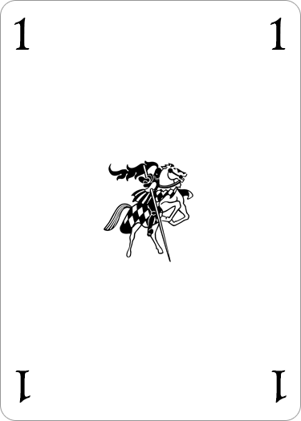

# Battle Royal

Free assets for the board game [Battle Royal](https://boardgamegeek.com/boardgame/32061/battle-royal).  
Includes rules, cards as png, pdf or psd. 
Feel free to download, modify and use any of these files as you please. 

Photoshop files: 
[rules.psd](/rules.psd) 
[cards.psd](/cards.psd) 
[card-page.psd](/card-page.psd) 
[knight.psd](/knight.psd)

## Rules (English)

[rules.pdf](/rules.pdf) (right-click - save as) 
[rules.txt](/rules.txt)

## Board (work in progress)

I started making a digital version of the board. (Almost one half is complete)  
[new-board](https://raw.githubusercontent.com/Krokodyl/battle-royal/master/img/wip/map.jpg) 
[old-board](https://raw.githubusercontent.com/Krokodyl/battle-royal/master/img/wip/map-old.jpg) 

## Cards

[print-and-play-cards.pdf](/cards.pdf) (right-click - save as)

There are four pages: pages 1 and 3 are font, pages 2 and 4 are back. 
As I don't know the original card size, I picked a common standard size. 
The card size is: 2.5" x 3.5"  or  63.5mm x 88.9mm 

### Image - Back

### Image - 0

### Image - 1

### Image - 2

### Image - 3

### Image - 4

## Logo

[Knight with white background](/img/knight-white.png)

[Knight with transparent background](/img/knight-transparent.png)

